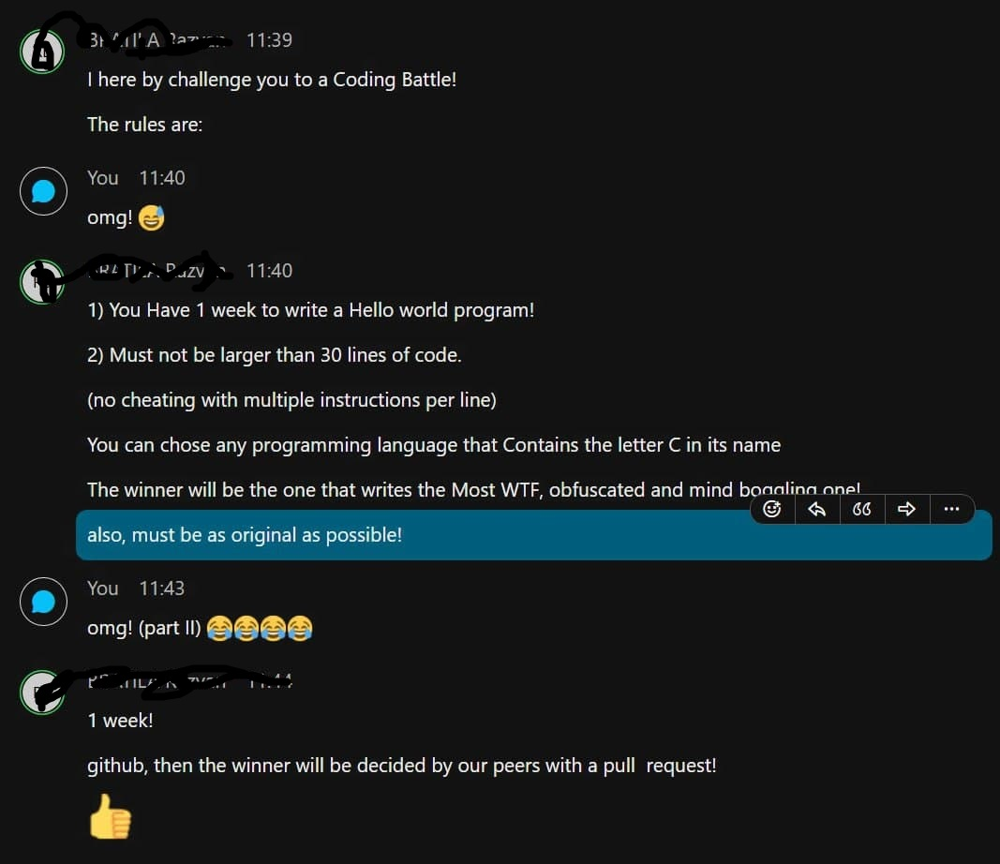

This solutions contains 3 projects:
* ThirtyChallenge
* FollowChallenge/AltChallenge(old name of project)
* ThirdOption

I started developing the challenge with VS2022 preview & was lucky that 1st non preview VS2022 was release same week ^_^'
The idea for using VS2022 was taking advantage of C# 10 /.Net Core 6 & [Top level statements](https://docs.microsoft.com/en-us/dotnet/csharp/whats-new/tutorials/top-level-statements)

These project are possible answers to the challenge presented 
here ( **I tried to follow the rules, but probably I have breached some in some way, I was just really trying to have fun :D**) :

